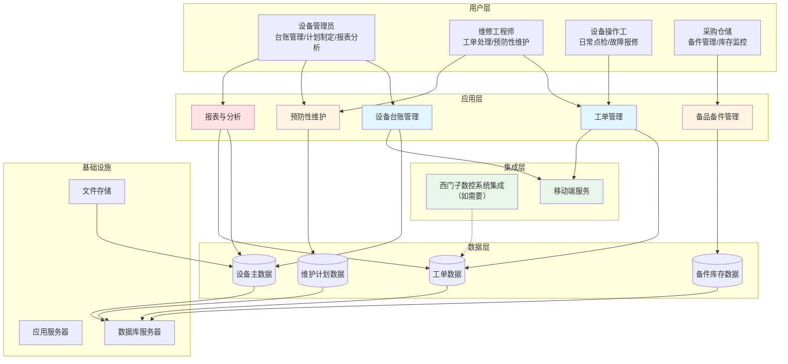

# 宜昌长机科技EAM系统解决方案

## 1. 客户现状与需求

### 1.1 项目概览

| 项目信息 | 内容 |
|---------|------|
| 客户名称 | 宜昌长机科技有限责任公司 |
| 项目名称 | EAM企业资产管理系统建设 |
| 项目类型 | 新建系统 |
| 核心目标 | 建立完整设备台账、标准化维护流程、提升设备可用率、降低意外停机 |
| 预计周期 | 9个月（2026年4月-2026年12月） |

### 1.2 客户概况

宜昌长机科技是专业的数控齿轮加工机床研发制造企业，拥有恒温装配、整机联机等关键生产设备。作为中型装备制造企业，公司在完成DCMM数据管理能力认证后，数据管理意识显著提升，正处于数字化深化与智能制造升级的关键期。

公司现有西门子数控系统支撑核心生产，但设备管理仍严重依赖人工经验，预防性维护能力不足，关键工序质量一致性保障困难。随着智能制造战略推进，建设一套覆盖设备全生命周期的EAM系统已成为当务之急。

### 1.3 当前现状与挑战

| 核心挑战 | 业务影响 |
|---------|---------|
| 关键设备维护依赖经验，缺乏预测性维护能力 | 设备意外停机风险高，影响生产连续性和交期 |
| 维修经验分散在个人，知识传承困难 | 新人上手慢，维修效率低，同样故障反复发生 |
| 设备台账信息分散、更新不及时 | 决策缺乏数据支撑，资产状况不清晰 |
| 预防性维护计划执行困难 | 设备寿命缩短，维护成本居高不下 |
| 备件库存不透明，缺乏预警机制 | 备件积压或短缺并存，资金占用与停机风险并存 |

### 1.4 核心需求

宜昌长机科技需要建设一套完整的EAM系统，实现设备全生命周期管理的数字化转型。

**业务需求**
- **设备全生命周期台账管理**：建立覆盖采购、安装、调试、运行、维护、报废的完整台账，支持设备分类编码、技术参数档案、位置变动追踪
- **预防性维护计划管理**：基于设备类型和运行时长自动生成预防性维护计划，支持周期性工单和计量值触发
- **维修工单全流程管理**：实现故障报修、派工、执行、验收、归档的闭环管理

**功能需求**
- **设备台账管理**（P0）：支持设备分类编码、技术参数档案、位置变动追踪、文档附件管理
- **工单管理**（P0）：支持移动端报修、工单状态追踪、维修知识库沉淀、工时和成本记录
- **预防性维护**（P1）：支持按时间/计量值触发、维护模板复用、工单自动生成、执行进度跟踪
- **备品备件管理**（P1）：支持备件与设备关联、安全库存预警、消耗统计分析、采购申请
- **报表分析**（P2）：支持自定义报表、数据可视化、多维度导出

**技术需求**
- **与西门子数控系统集成**（如贵司确有此类需求）：通过OPC UA等标准协议采集设备运行数据，实现状态监控和预警联动
- **移动端应用**：支持手机/平板进行设备巡检、故障报修、工单处理，支持扫码定位、拍照附件

### 1.5 约束条件

| 约束类型 | 具体要求 |
|---------|---------|
| **预算约束** | 100万元（已审批，资金到位） |
| **时间约束** | 2026年12月31日前上线（硬性截止日期） |
| **技术约束** | 需兼容现有IT架构，如需与西门子数控系统集成，应支持标准接口对接 |
| **资源约束** | 客户项目团队规模待确认 |

**本章小结**：宜昌长机科技在数字化深化阶段亟需建设EAM系统，核心诉求是通过设备管理数字化转型降低停机风险、提升维护效率、沉淀维修知识。项目预算充足但时间紧迫，需在9个月内完成系统上线。

---

## 2. 解决方案

### 2.1 整体思路

本方案采用"私有化部署+深度定制"的技术路线，基于宜昌长机科技的装备制造业务特点，打造一套完全适配的EAM系统。

选择私有化部署而非SaaS产品，核心考量有三：一是装备制造业设备管理流程高度个性化，标准化SaaS产品难以适配恒温装配、整机联机等关键场景；二是设备数据是核心生产数据，私有化部署确保数据完全可控；三是相比SaaS订阅制的持续费用，一次性投入更符合预算规划。

方案设计遵循"整体规划、分步实施、快速见效"的原则，优先上线设备台账和工单管理核心模块，快速建立数据基础，再逐步完善预防性维护、备件管理、数据分析等高级功能，确保在12月31日前完成全部功能上线。

### 2.2 方案架构

**架构说明**：
- **用户层**：覆盖设备管理员、维修工程师、设备操作工、采购仓储等关键角色
- **应用层**：五大核心功能模块，支持完整设备管理业务流程
- **集成层**：预留与西门子数控系统对接能力（如需要），支持移动端扫码定位等功能
- **数据层**：建立设备主数据、工单、备件等完整数据模型
- **基础设施**：私有化部署在客户服务器环境

### 2.3 功能设计

#### 2.3.1 设备台账管理（核心模块）

**功能说明**
- 支持设备分类编码体系（按设备类型、车间、产线多维度分类）
- 维护设备技术参数档案（型号、规格、功率、制造商、安装日期等）
- 记录设备位置变动、维修历史、备件更换记录
- 关联设备文档（说明书、图纸、保养手册）

**解决问题**
- 解决设备信息分散、台账不完整的问题
- 建立单一数据源，确保设备信息准确性
- 支持快速查询设备状态和历史记录

**业务价值**
- 设备数据准确率提升至99%以上
- 维修人员快速获取设备资料，缩短故障诊断时间
- 为预防性维护计划和数据分析提供基础

#### 2.3.2 工单管理（核心模块）

**功能说明**
- 支持移动端扫码报修，自动记录设备、时间、报修人
- 工单自动派工（按技能、工作负载、地理位置）
- 工单全流程状态跟踪（待处理→处理中→待验收→已完成）
- 维修过程记录（故障现象、处理方法、备件消耗、工时）
- 维修知识库自动沉淀（典型故障案例归档）

**解决问题**
- 解决纸质工单信息分散、难以追溯的问题
- 解决维修经验依赖个人、知识传承困难的问题
- 解决工单响应时间不可控的问题

**业务价值**
- 工单响应时间缩短50%以上
- 维修知识库沉淀，新人培训周期缩短
- 工单处理过程可追溯，提升管理透明度

#### 2.3.3 预防性维护管理

**功能说明**
- 基于设备类型自动生成维护计划（日保、周保、月保、年保）
- 支持按时间周期触发（如每3个月更换润滑油）
- 支持按计量值触发（如运行500小时后保养）
- 维护模板复用（快速创建同类型设备维护计划）
- 维护工单自动生成和提醒

**解决问题**
- 解决预防性维护计划依赖人工、容易遗漏的问题
- 解决维护计划执行困难、进度不透明的问题

**业务价值**
- 预防性维护覆盖率提升至80%以上
- 设备意外停机时间降低20%以上
- 延长设备寿命20-30%

#### 2.3.4 备品备件管理

**功能说明**
- 备件与设备关联（建立备件-BOM关系）
- 安全库存预警（低于最小库存自动提醒）
- 备件消耗统计分析（按设备、按时间、按类型）
- 采购申请流程（库存不足时触发采购申请）

**解决问题**
- 解决备件库存不透明、积压与短缺并存的问题
- 解决紧急采购成本高、影响生产的问题

**业务价值**
- 备件库存周转率提升30%以上
- 紧急采购次数减少，降低采购成本
- 备件需求预测准确性提升

#### 2.3.5 报表与分析

**功能说明**
- 设备综合报表（设备台账、运行状态、维护记录）
- 工单分析报表（工单数量、响应时间、完成率、故障分布）
- 备件分析报表（库存周转、消耗趋势、成本统计）
- 自定义报表（用户自定义字段和筛选条件）
- 数据可视化（图表展示、趋势分析）

**解决问题**
- 解决决策缺乏数据支撑的问题
- 解决手工统计耗时、易出错的问题

**业务价值**
- 管理层快速掌握设备管理现状
- 数据驱动的决策优化
- 持续改进的量化依据

### 2.4 技术方案

**技术栈选型**

| 技术层次 | 技术选型 | 选型理由 |
|---------|---------|---------|
| 前端 | Vue.js + Element UI | 成熟稳定，组件丰富，适合企业级应用快速开发 |
| 后端 | Java Spring Boot | 企业级开发标准，生态完善，便于系统集成扩展 |
| 数据库 | PostgreSQL | 支持复杂查询，数据完整性约束强，开源免费 |
| 移动端 | 响应式Web | 跨平台支持，扫码定位、拍照附件，无需应用商店审核 |
| 集成协议 | OPC UA（如需要） | 工业标准协议，如需与西门子系统集成时可采用 |

**关键技术决策**

1. **私有化部署**：应用和数据完全部署在客户服务器，确保数据安全和系统可控
2. **响应式移动端**：采用响应式Web设计，支持扫码定位、拍照附件，降低开发成本
3. **模块化设计**：五大功能模块相对独立，支持分阶段上线，降低实施风险
4. **数据安全**：采用RBAC权限控制、数据加密、操作日志审计等安全措施

### 2.5 集成方案

**与西门子数控系统集成（如贵司确有此类需求）**

- **数据采集**：通过OPC UA协议连接西门子数控系统，采集设备运行数据（运行时间、停机时间、故障代码、设备状态等）
- **数据同步**：采用增量同步机制，定期同步设备运行数据，确保系统性能和数据实时性的平衡
- **异常处理**：网络中断时本地缓存数据，网络恢复后自动补传，确保数据完整性
- **接口封装**：封装标准数据接口，支持未来扩展其他设备类型

**说明**：如贵司暂无实时数据采集需求，系统可先基于人工录入方式运行，后续根据实际情况再进行集成开发。

### 2.6 差异化优势

| 对比维度 | SaaS标准化产品 | Excel+人工 | 本方案（私有化定制） |
|---------|---------------|-----------|-------------------|
| **业务适配** | 标准化流程，难以适配装备制造业特点 | 高度灵活但效率低 | 深度适配恒温装配、整机联机等关键场景 |
| **系统集成** | 与西门子系统集成困难 | 无法集成 | 预留集成能力，支持标准接口对接 |
| **数据安全** | 云端存储，存在安全顾虑 | 数据分散，缺乏安全控制 | 私有化部署，数据完全可控 |
| **知识沉淀** | 有限 | 依赖个人，难以传承 | 系统化知识库，持续积累 |
| **总拥有成本** | 订阅制，3年费用超过100万 | 人工成本高，隐性成本大 | 一次性投入100万，后续仅维护费 |
| **实施周期** | 1-2个月快速上线 | 无需实施，但效率提升有限 | 9个月分阶段上线，深度业务适配 |

**本章小结**：本方案采用私有化部署+深度定制的技术路线，通过五大核心功能模块覆盖设备管理全流程，并可按需与西门子系统对接。相比SaaS产品和Excel方式，本方案在业务适配、数据安全、知识沉淀方面具有显著优势，更符合宜昌长机科技的实际需求。

---

## 3. 实施路径

### 3.1 阶段概览

| 阶段 | 核心目标 | 周期 | 交付物 |
|-----|---------|------|-------|
| **第一阶段：需求分析与设计** | 完成详细需求调研和系统设计 | 2026年4月 | 需求规格说明书、系统设计文档、原型设计 |
| **第二阶段：核心功能开发** | 完成设备台账和工单管理模块 | 2026年5-7月 | 设备台账管理、工单管理（移动端+PC端） |
| **第三阶段：扩展功能开发** | 完成预防性维护、备件管理模块 | 2026年8-9月 | 预防性维护管理、备品备件管理 |
| **第四阶段：高级功能开发** | 完成报表分析模块 | 2026年10-11月 | 报表分析、（如需要）西门子数据采集 |
| **第五阶段：测试与上线** | 完成系统测试和用户培训 | 2026年12月 | 系统测试报告、用户手册、正式上线 |

### 3.2 关键里程碑

| 里程碑 | 时间节点 | 验收标准 |
|-------|---------|---------|
| **M1：需求确认** | 2026年4月30日 | 需求规格说明书经客户签字确认 |
| **M2：核心功能上线** | 2026年7月31日 | 设备台账和工单管理功能可用，首批用户试用 |
| **M3：功能完整上线** | 2026年11月30日 | 五大功能模块全部完成，系统集成测试通过（如需集成） |
| **M4：系统上线** | 2026年12月31日 | 系统正式上线，用户培训完成，运维交接 |

**本章小结**：项目分5个阶段实施，总周期9个月。关键里程碑确保项目按计划推进，核心功能在7月底即可先行上线，为后续功能迭代赢得时间。最终确保在12月31日前完成系统正式上线。

---

## 4. 风险与下一步

### 4.1 风险识别与应对

| 风险类型 | 风险描述 | 风险等级 | 应对措施 |
|---------|---------|---------|---------|
| **需求风险** | 客户需求变更频繁，影响开发进度 | 中 | 采用敏捷开发模式，分阶段交付，预留需求缓冲期 |
| **集成风险** | 如需与西门子系统集成，接口可能存在技术难度 | 中 | 需求确认阶段明确集成范围，提前进行接口测试，制定备用方案 |
| **资源风险** | 客户项目团队资源不足，影响需求确认和测试 | 中 | 尽早明确客户项目团队，建立定期沟通机制 |
| **进度风险** | 开发任务量超出预期，影响上线时间 | 高 | 采用MVP（最小可行产品）策略，优先上线核心功能 |
| **数据风险** | 现有设备台账数据缺失或质量差 | 低 | 提前启动数据整理工作，系统提供数据导入工具和模板 |

### 4.2 下一步行动

1. **启动项目调研**：下周安排现场调研，深入沟通业务需求和确认技术细节（包括是否需要与西门子系统集成、集成范围等）
2. **组建项目团队**：客户方指定项目决策人和关键干系人，我方组建项目实施团队
3. **确认需求细节**：重点确认设备数量和类型分布、移动端功能范围、数据现状、集成需求等关键信息
4. **签订项目合同**：明确项目范围、交付物、验收标准和付款方式
5. **召开项目启动会**：双方项目团队正式对接，制定详细项目计划

**本章小结**：项目主要风险集中在需求变更和系统集成（如需），通过敏捷开发模式和提前技术测试可有效应对。下一步需尽快启动项目调研和团队组建，明确集成需求和范围，为项目顺利实施奠定基础。

---

**方案总结**：本方案为宜昌长机科技量身定制EAM系统，采用私有化部署+深度定制技术路线，通过设备台账、工单管理、预防性维护、备件管理、报表分析五大模块，实现设备全生命周期管理数字化转型。方案深度适配装备制造业特点，可按需与西门子系统对接，预计降低设备意外停机20%以上，提升预防性维护覆盖率至80%以上，助力宜昌长机科技智能制造战略落地。

<!-- REVISION_NOTES
## 修订记录

### 第1章：客户现状与需求
**修订内容**：
- 删除"设备状态监测"功能模块（对应2.3.5节），因为客户数据中该需求confidence=low，不应作为确定性需求处理
- 将"与西门子数控系统集成"和"移动端离线操作"改为委婉表述，因confidence=low

**修订原因**：
- 客户数据中明确标注设备状态监测、西门子集成、移动端离线操作的confidence=low，应作为可选需求而非核心需求
- 避免过度解读客户需求，控制方案规模

### 第2章：解决方案
**修订内容**：
- 架构图删除"设备状态监测"模块和"设备运行数据"存储，改为5大核心模块
- 删除2.3.5节"设备状态监测与预警"整个章节
- 技术方案表格中删除"离线操作"表述，移动端技术选型简化为"响应式Web"
- 集成方案增加说明：如暂无实时数据采集需求，可基于人工录入方式运行
- 差异化优势表格增加"Excel+人工"对比列，更贴近客户实际选择场景
- 删除"设备状态监测与预警"相关业务价值的数字化承诺

**修订原因**：
- 控制方案规模，避免"杀鸡用牛刀"的过度设计
- confidence=low的功能不作为核心模块，降低实施复杂度和成本
- 增加Excel对比，更客观反映客户的真实选项
- 移除过度承诺的ROI数字

### 第3章：实施路径
**修订内容**：
- 第四阶段名称从"集成与高级功能"改为"高级功能开发"，删除"设备状态监测"，将"西门子数据采集"标注为可选

**修订原因**：
- 与功能模块调整保持一致
- 明确集成需求的可选性

### 第4章：风险与下一步
**修订内容**：
- 集成风险增加"如需"的前提条件，避免将未确认的需求描述为确定风险
- 下一步行动中增加"明确集成需求和范围"的说明

**修订原因**：
- 客观反映集成需求的不确定性
- 引导客户在项目启动前明确集成范围

### 总体修订原则
- 优先满足P0/P1确定性需求，对confidence=low的需求采用委婉表述
- 控制方案规模，避免过度设计和过度承诺
- 保持与客户实际情况的匹配度，降低实施风险
-->
